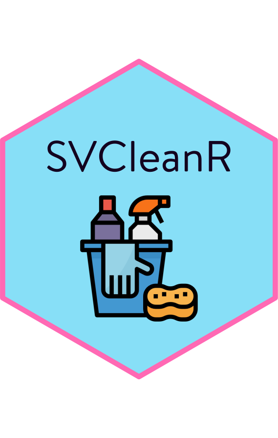

# SVSCleanR </a>

## Beschreibung  
`SVCleanR` ist ein R-Paket, das speziell dafür entwickelt wurde, das Cleaning von HEX-Daten einfacher aber auch effizienter zu gestalten.

Für eine Übersicht und Beispiele der einzelnen Funktionen, kann das [Wiki](https://github.com/maltehueckstaedt/SVCleanR/wiki) konsultiert werden.

## Installation

`SVCleanR` kann folgendermaßen installiert werden:

```r
remotes::install_github("maltehueckstaedt/SVCleanR")
```

### Paket-Update: Wie aktualisiere ich SVCleanR?

Wenn du bereits eine ältere Version von `SVCleanR` installiert hast und auf die neueste Version updaten möchtest, kannst du den Installationsbefehl mit dem Argument `force = TRUE` ausführen. Dadurch wird die aktuellste Version von GitHub installiert und die alte Version überschrieben:

```r
remotes::install_github("maltehueckstaedt/SVCleanR", force = TRUE)
```

[](https://mybinder.org/v2/gh/maltehueckstaedt/SVCleanR/HEAD?urlpath=%2Fdoc%2Ftree%2Ftest%2Ftest_file.R)